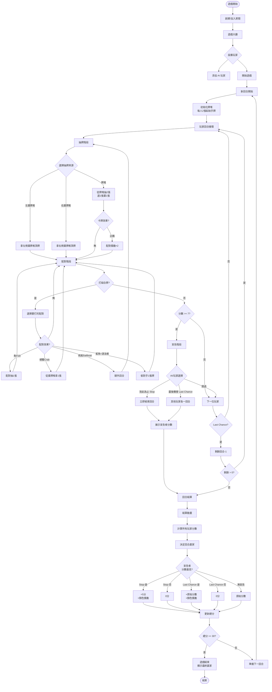
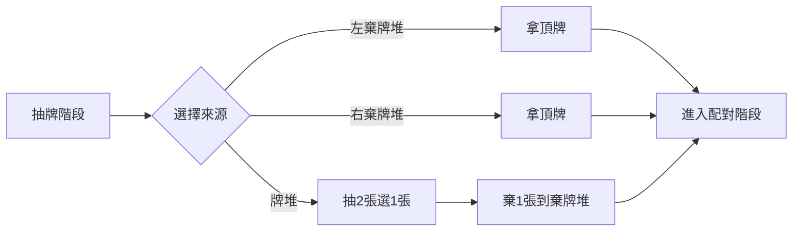
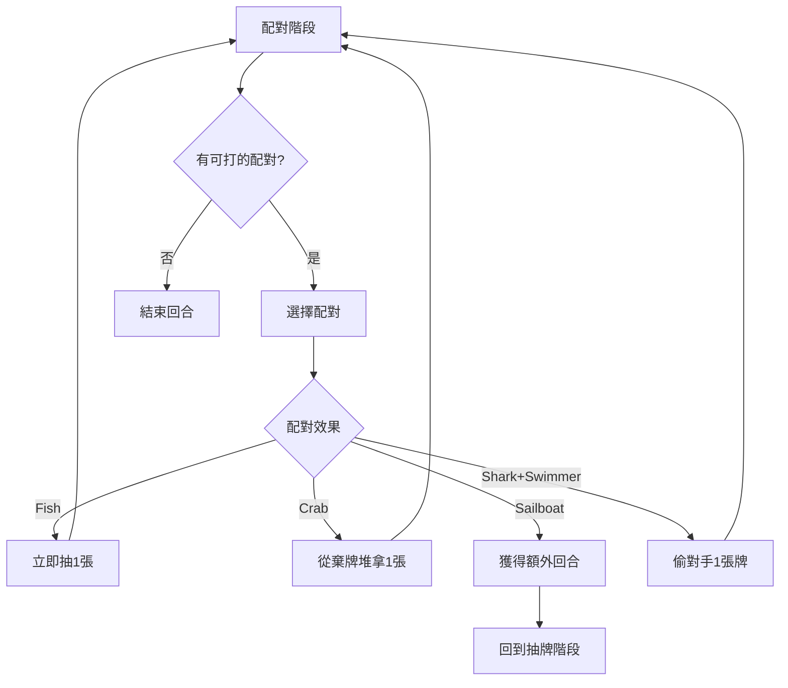
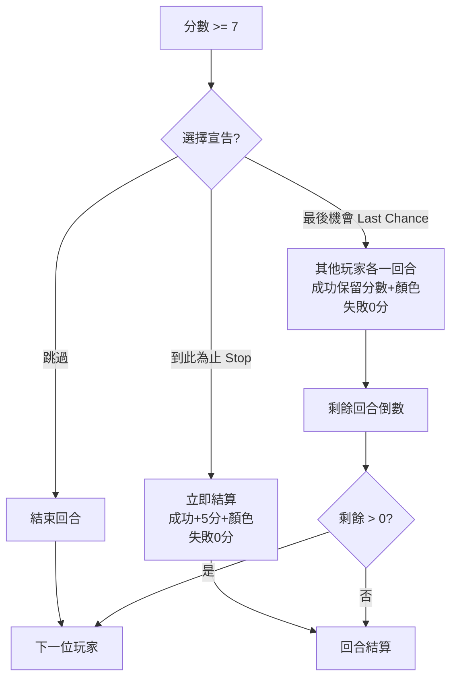
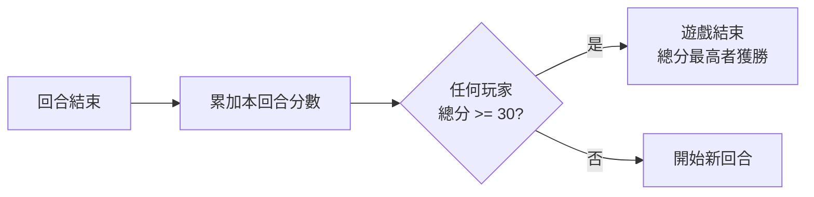
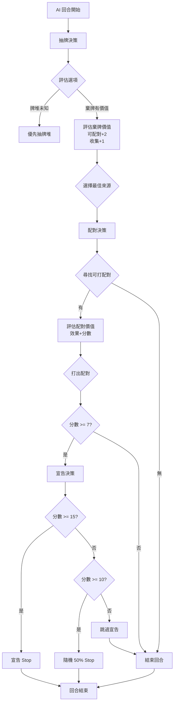

# 🌊 海鹽與紙牌 - 完整遊戲流程圖

## 總覽流程



## 詳細階段說明

### 1️⃣ 遊戲初始化
- **房間創建**: 玩家創建或加入房間
- **玩家設置**: 添加人類玩家或 AI 玩家（最多4人）
- **開始遊戲**: 初始化牌堆，每人發2張牌

### 2️⃣ 回合階段

#### 抽牌階段 (Draw Phase)


#### 配對階段 (Pair Phase)


#### 宣告階段 (Declare Phase)


### 3️⃣ 計分系統

#### 基礎計分
```
1. 手牌分數：每張牌的點數相加
2. 配對獎勵：每個已打出的配對 +1 分
3. 倍數卡：企鵝配對使配對獎勵 ×2
4. 特殊卡：
   - FishSchool (魚群): 每條Fish額外 +1
   - Captain (船長): 每位Swimmer額外 +3
```

#### 美人魚計分（特殊規則）
```
每條美人魚 = 第N多的顏色數量
- 第1條美人魚 = 最多的顏色數量
- 第2條美人魚 = 第2多的顏色數量
```

#### 顏色獎勵
```
只有 Stop 成功 或 Last Chance 成功才能獲得
擁有最多某種顏色：該顏色數量作為額外分數
```

### 4️⃣ 宣告模式對照表

| 宣告模式 | 條件 | 成功 | 失敗 |
|---------|------|------|------|
| **Stop** | 立即結算 | 原始分數 + 5 + 顏色獎勵 | 0 分 |
| **Last Chance** | 其他玩家各一回合 | 原始分數 + 顏色獎勵 | 0 分 |
| **無宣告** | - | 原始分數（無顏色獎勵） | - |

### 5️⃣ 遊戲結束條件



## 卡牌類型與效果

### 基礎卡牌
| 卡牌 | 點數 | 配對效果 | 數量 |
|------|------|----------|------|
| Fish (魚) | 0-3 | 配對抽1張 | 多張 |
| Crab (螃蟹) | 0-3 | 配對從棄牌堆拿1張 | 多張 |
| Shell (貝殼) | 0-3 | 無 | 多張 |
| Penguin (企鵝) | 0 | 配對獎勵×2 | 2張 |

### 特殊卡牌
| 卡牌 | 點數 | 效果 |
|------|------|------|
| Mermaid (美人魚) | 0 | 特殊計分 |
| Sailboat (帆船) | 0 | 配對獲得額外回合 |
| Shark (鯊魚) | 0 | 配對+游泳者=偷牌 |
| Swimmer (游泳者) | 0 | 配對+鯊魚=偷牌 |
| FishSchool (魚群) | 0 | 每條Fish +1 |
| Captain (船長) | 0 | 每位Swimmer +3 |
| PenguinColony (企鵝群) | 0 | 每隻Penguin +1 |

## AI 決策流程



## 測試關鍵時刻

### 📸 需要截圖的時刻
1. ✅ **遊戲初始化**: 所有玩家就緒，牌堆初始化
2. ✅ **首次配對**: 第一位玩家打出配對
3. ✅ **特殊效果觸發**:
   - 偷牌效果 (Shark+Swimmer)
   - 額外回合 (Sailboat)
   - 從棄牌堆拿牌 (Crab)
4. ✅ **宣告時刻**:
   - AI 宣告 "到此為止 (Stop)"
   - AI 宣告 "最後機會 (Last Chance)"
5. ✅ **回合結算**: 展示所有玩家分數
6. ✅ **遊戲結束**: 最終贏家宣布

---

**Created**: 2025-12-24
**Version**: 1.0
**For**: Playwright E2E Testing Reference
