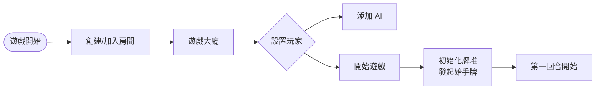
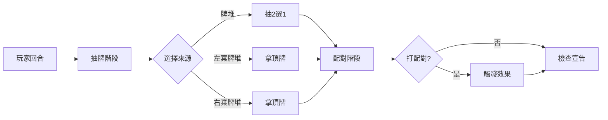
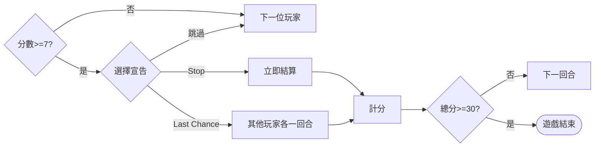
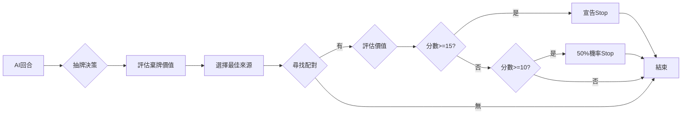
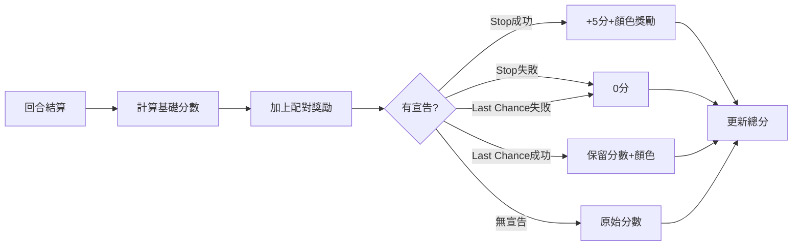

# 🌊 海鹽與紙牌 - 遊戲流程圖（橫向版本）

> 💡 **提示**：此版本使用橫向佈局（LR），適合在 Obsidian 等 Markdown 編輯器中查看

## 簡化總覽流程（橫向）

## 詳細遊戲流程（分段顯示）

### 第一階段：遊戲初始化

### 第二階段：玩家回合流程

### 第三階段：宣告與結算

### 第四階段：AI 決策流程

### 第五階段：計分系統

## 特殊效果流程

### Fish 配對效果

### Crab 配對效果

### Sailboat 配對效果

### Shark+Swimmer 組合

---

## 💡 Obsidian 查看技巧

1. **切換到閱讀模式**：按 `Ctrl+E`
2. **調整縮放**：`Ctrl+-` 縮小，`Ctrl+0` 重置
3. **全螢幕查看**：按 `F11`
4. **匯出為 PDF**：右鍵 → Export to PDF

## 🔗 相關文檔

- 完整版流程圖：`GAME_FLOW_DIAGRAM.md`
- 測試指南：`E2E_TEST_GUIDE.md`
- 測試報告模板：`AI_BATTLE_TEST_REPORT.md`
