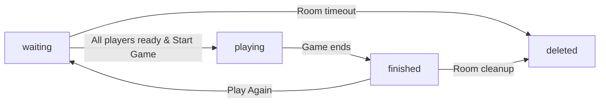
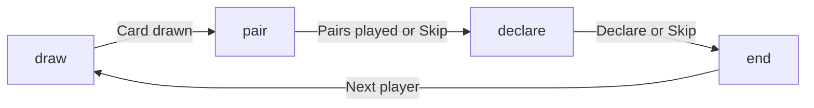
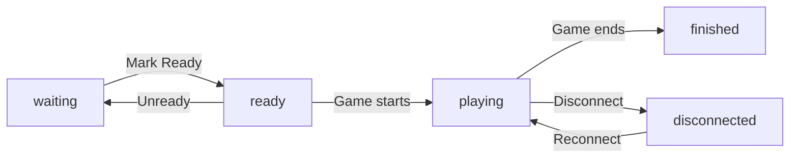

# Sea Salt & Paper - Room & Data Model Specification

> **Purpose**: Complete data model specification for room structure, game state, and real-time synchronization
> **Audience**: UI/UX Designers, Frontend Engineers, Backend Engineers
> **Last Updated**: 2025-11-14
> **Version**: 1.0.0

---

## 📋 Table of Contents

1. [Overview](#overview)
2. [Room Data Model](#room-data-model)
3. [Player Data Model](#player-data-model)
4. [Game State Model](#game-state-model)
5. [Card Data Model](#card-data-model)
6. [Action & Event Model](#action--event-model)
7. [Firebase Structure](#firebase-structure)
8. [Real-time Synchronization](#real-time-synchronization)
9. [State Transitions](#state-transitions)
10. [Data Flow Diagrams](#data-flow-diagrams)
11. [API Reference](#api-reference)
12. [Examples](#examples)

---

## Overview

This document defines the complete data architecture for the Sea Salt & Paper multiplayer card game. The system uses Firebase Realtime Database for real-time synchronization across 2-4 players.

### Key Concepts

- **Room**: A game session that players join via room code
- **Player**: A participant (human or AI) in a room
- **Game State**: Current state of the game (deck, discard piles, turn info)
- **Real-time Sync**: All changes propagate instantly to all players
- **Atomic Updates**: Critical operations use Firebase transactions

---

## Room Data Model

### Complete Room Structure

```javascript
{
  // Room Identity
  roomId: "ABC123",                    // 6-character alphanumeric code
  hostId: "player-uuid-1234",          // Creator of the room

  // Room Status
  status: "waiting",                   // "waiting" | "playing" | "finished"

  // Player Management
  players: {
    "player-uuid-1234": {
      // Player Identity
      id: "player-uuid-1234",
      name: "Player 1",
      avatar: "🐟",                    // Optional emoji avatar

      // Player Role
      isHost: true,
      isReady: true,
      isAI: false,
      aiDifficulty: null,              // "easy" | "medium" | "hard" | null

      // Game State
      score: 23,                       // Current total score
      roundScore: 7,                   // Score this round
      hand: [                          // Cards in player's hand
        "fish_1",
        "crab_2",
        "octopus_3"
      ],
      handCount: 3,                    // Number of cards (visible to all)

      // Played Pairs
      playedPairs: [
        {
          id: "pair-uuid-1",
          cards: ["fish_1", "fish_2"],
          pairType: "Fish",
          hasEffect: true,
          effectApplied: true,
          timestamp: 1699999999999
        }
      ],

      // Connection Status
      connected: true,
      lastSeen: 1699999999999,

      // Round Declaration
      hasDeclared: false,              // Declared "Stop" or "Last Chance"
      declarationType: null            // "stop" | "last_chance" | null
    }
    // ... other players
  },

  // Game Settings
  settings: {
    maxPlayers: 4,
    targetScore: "auto",               // "auto" | 30 | 35 | 40 | custom
    customScore: null,                 // Number if targetScore is "custom"
    startingHandSize: 0,               // Cards dealt at game start
    mermaidsWin: true,                 // 4 mermaids = instant win
    colorBonus: true,                  // Award bonus for most common color
    aiCount: 0,                        // Number of AI players
    aiDifficulty: "medium"             // Default AI difficulty
  },

  // Game State
  gameState: {
    // Deck Management
    deck: ["fish_1", "crab_2", ...],   // Remaining cards in deck
    deckCount: 32,                     // Number of cards left

    // Discard Piles
    discardLeft: [                     // Left discard pile
      "octopus_1",
      "shell_3"
    ],
    discardRight: [                    // Right discard pile
      "penguin_2",
      "turtle_1"
    ],

    // Turn Management
    currentPlayerIndex: 0,             // Index in players array
    currentPlayerId: "player-uuid-1234",
    round: 1,                          // Current round number
    turnPhase: "draw",                 // "draw" | "pair" | "declare" | "end"
    turnNumber: 15,                    // Total turns played

    // Last Action
    lastAction: {
      playerId: "player-uuid-1234",
      playerName: "Player 1",
      action: "draw_deck",             // Action type
      details: {                       // Action-specific details
        cardDrawn: "fish_1",
        from: "deck"
      },
      timestamp: 1699999999999
    },

    // Round End
    roundEnding: false,                // Round is ending
    declaringPlayer: null,             // Player who declared
    lastChanceActive: false            // In "Last Chance" phase
  },

  // Action Log
  actionLog: [
    {
      id: "action-uuid-1",
      playerId: "player-uuid-1234",
      playerName: "Player 1",
      action: "draw_deck",
      message: "Player 1 drew from deck",
      timestamp: 1699999999999,
      isRecent: true
    }
    // ... max 20 most recent actions
  ],

  // Timestamps
  createdAt: 1699999999999,
  startedAt: 1699999999999,            // When game started
  finishedAt: null,                    // When game ended
  lastActivity: 1699999999999          // Last action timestamp
}
```

### Room Status States

```javascript
const ROOM_STATUS = {
  WAITING: "waiting",      // Lobby, waiting for players
  PLAYING: "playing",      // Game in progress
  FINISHED: "finished"     // Game completed
}
```

### Room Code Generation

```javascript
// Format: 6 alphanumeric characters (uppercase)
// Example: "ABC123", "XYZ789"
// Pattern: [A-Z0-9]{6}
// Collision handling: Check Firebase for uniqueness
```

---

## Player Data Model

### Player States

```javascript
const PLAYER_STATUS = {
  WAITING: "waiting",      // In lobby, not ready
  READY: "ready",          // In lobby, ready to start
  PLAYING: "playing",      // In active game
  DISCONNECTED: "disconnected"  // Lost connection
}
```

### Player Types

```javascript
const PLAYER_TYPES = {
  HUMAN: "human",          // Real player
  AI_EASY: "ai_easy",      // AI (easy difficulty)
  AI_MEDIUM: "ai_medium",  // AI (medium difficulty)
  AI_HARD: "ai_hard"       // AI (hard difficulty)
}
```

### Minimal Player Structure (for Opponents)

```javascript
// What opponents see about other players
{
  id: "player-uuid-1234",
  name: "Player 1",
  avatar: "🐟",
  isAI: false,
  score: 23,
  handCount: 3,              // Don't expose actual hand
  playedPairs: [...],        // Visible pairs
  connected: true,
  hasDeclared: false
}
```

---

## Game State Model

### Turn Phases

```javascript
const TURN_PHASES = {
  DRAW: "draw",            // Player must draw card(s)
  PAIR: "pair",            // Player may play pairs (optional)
  DECLARE: "declare",      // Player may declare Stop/Last Chance
  END: "end"               // Turn ending, moving to next player
}
```

### Turn Phase Flow

```
DRAW → PAIR → DECLARE → END
  ↓      ↓       ↓       ↓
 [Draw] [Play  [Declare [Next
  card   pairs] round    player]
  (req)] (opt)] end(opt)]
```

### Game Actions

```javascript
const GAME_ACTIONS = {
  // Draw Phase
  DRAW_DECK: "draw_deck",              // Draw from deck (2 cards, choose 1)
  DRAW_DISCARD_LEFT: "draw_discard_left",
  DRAW_DISCARD_RIGHT: "draw_discard_right",

  // Pair Phase
  PLAY_PAIR: "play_pair",              // Play matching pair
  DISCARD_TO_LEFT: "discard_to_left",
  DISCARD_TO_RIGHT: "discard_to_right",

  // Declare Phase
  DECLARE_STOP: "declare_stop",        // End round immediately
  DECLARE_LAST_CHANCE: "declare_last_chance",  // One more turn for others

  // Special Actions (from pair effects)
  STEAL_CARD: "steal_card",            // Crab pair effect
  DRAW_BLIND: "draw_blind",            // Fish pair effect
  SWAP_DISCARD: "swap_discard",        // Octopus pair effect
  EXTRA_TURN: "extra_turn",            // Sailboat pair effect

  // System Actions
  END_TURN: "end_turn",
  END_ROUND: "end_round",
  END_GAME: "end_game"
}
```

---

## Card Data Model

### Complete Card Structure

```javascript
{
  // Card Identity
  id: "fish_1",                        // Unique ID
  name: "Fish",                        // Card name
  displayName: "Fish",                 // Display name (i18n ready)

  // Visual
  emoji: "🐟",                         // Card icon
  color: "blue",                       // "blue" | "red" | "yellow" | "purple"
  colorHex: "#3498DB",                 // Hex color code

  // Card Type
  type: "pair_effect",                 // "pair_effect" | "collection" | "multiplier" | "special"

  // Scoring
  value: 1,                            // Base point value

  // Pair Effects
  pairEffect: "draw_blind",            // Effect when paired
  pairDescription: "Draw 1 card from deck without looking",

  // Multiplier (for Penguin, Turtle)
  multiplierTarget: null,              // Card type to multiply
  multiplierValue: null,               // Multiplier amount

  // Special Properties
  isSpecial: false,                    // Mermaid (special scoring)
  canPairWith: ["fish_2", "fish_3"],  // Valid pairing cards (or type)

  // Metadata
  rarity: "common",                    // "common" | "uncommon" | "rare"
  count: 10                            // Total copies in deck
}
```

### Card Types Reference

```javascript
const CARD_TYPES = {
  // Pair Effect Cards (draw/steal/swap)
  FISH: {
    name: "Fish",
    emoji: "🐟",
    color: "blue",
    value: 1,
    count: 10,
    pairEffect: "draw_blind"
  },
  CRAB: {
    name: "Crab",
    emoji: "🦀",
    color: "red",
    value: 1,
    count: 10,
    pairEffect: "steal_card"
  },
  OCTOPUS: {
    name: "Octopus",
    emoji: "🐙",
    color: "yellow",
    value: 1,
    count: 10,
    pairEffect: "swap_discard"
  },

  // Collection Cards (score when paired)
  SHELL: {
    name: "Shell",
    emoji: "🐚",
    color: "purple",
    value: 3,
    count: 7,
    pairEffect: null
  },

  // Multiplier Cards
  PENGUIN: {
    name: "Penguin",
    emoji: "🐧",
    color: "blue",
    value: 0,
    count: 7,
    multiplierTarget: "blue",
    multiplierValue: 2
  },
  TURTLE: {
    name: "Turtle",
    emoji: "🐢",
    color: "yellow",
    value: 0,
    count: 7,
    multiplierTarget: "yellow",
    multiplierValue: 2
  },

  // Special Cards
  SAILBOAT: {
    name: "Sailboat",
    emoji: "⛵",
    color: "red",
    value: 2,
    count: 7,
    pairEffect: "extra_turn"
  },
  SHARK: {
    name: "Shark",
    emoji: "🦈",
    color: "red",
    value: 3,
    count: 4
  },
  SWIMMER: {
    name: "Swimmer",
    emoji: "🏊",
    color: "blue",
    value: 3,
    count: 4,
    specialPair: "shark"  // Can pair with Shark
  },
  MERMAID: {
    name: "Mermaid",
    emoji: "🧜",
    color: null,  // No color (multicolor)
    value: 0,
    count: 4,
    isSpecial: true,
    specialScoring: "color_count"  // Score = Nth most common color
  }
}
```

---

## Action & Event Model

### Action Log Structure

```javascript
{
  id: "action-uuid-1234",

  // Actor
  playerId: "player-uuid-1234",
  playerName: "Player 1",

  // Action Type
  action: "draw_deck",               // From GAME_ACTIONS

  // Human-readable message
  message: "Player 1 drew from deck",

  // Action Details
  details: {
    cardDrawn: "fish_1",
    from: "deck",
    // ... action-specific data
  },

  // Metadata
  timestamp: 1699999999999,
  turnNumber: 15,
  round: 1,
  isRecent: true                     // Last 3 actions
}
```

### Common Action Examples

```javascript
// Draw from Deck
{
  action: "draw_deck",
  message: "Player 1 drew from deck",
  details: {
    cardsOffered: ["fish_1", "crab_2"],
    cardChosen: "fish_1",
    cardReturned: "crab_2"
  }
}

// Play Pair
{
  action: "play_pair",
  message: "Player 1 played Fish pair",
  details: {
    pairType: "Fish",
    cards: ["fish_1", "fish_2"],
    hasEffect: true,
    effectText: "Draw 1 card"
  }
}

// Declare Stop
{
  action: "declare_stop",
  message: "Player 1 declared Stop!",
  details: {
    currentScore: 23,
    roundScore: 7
  }
}

// Steal Card (Crab effect)
{
  action: "steal_card",
  message: "Player 1 stole a card from Player 2",
  details: {
    from: "player-uuid-5678",
    fromName: "Player 2",
    cardStolen: "shell_3"  // Only visible to stealer
  }
}
```

---

## Firebase Structure

### Database Paths

```
/rooms
  /{roomId}
    /roomId: "ABC123"
    /hostId: "player-uuid-1234"
    /status: "playing"
    /players
      /{playerId}
        /id: "player-uuid-1234"
        /name: "Player 1"
        /score: 23
        /hand: [...]
        /playedPairs: [...]
        ... (see Player model)
    /settings
      /maxPlayers: 4
      /targetScore: "auto"
      ... (see Settings model)
    /gameState
      /deck: [...]
      /discardLeft: [...]
      /discardRight: [...]
      /currentPlayerIndex: 0
      ... (see GameState model)
    /actionLog
      /{actionId}
        /action: "draw_deck"
        /message: "Player 1 drew from deck"
        ... (see Action model)
    /createdAt: 1699999999999
    /startedAt: 1699999999999
    /finishedAt: null

/players
  /{playerId}
    /playerId: "player-uuid-1234"
    /name: "Player Name"
    /gamesPlayed: 42
    /gamesWon: 15
    /totalScore: 1337
    /achievements: [...]
    /createdAt: 1699999999999
    /lastActive: 1699999999999

/gameHistory
  /{gameId}
    /gameId: "game-uuid-1234"
    /roomId: "ABC123"
    /players: ["player-1", "player-2"]
    /winner: "player-1"
    /finalScores: {...}
    /playedAt: 1699999999999
```

### Security Rules Considerations

```javascript
{
  "rules": {
    "rooms": {
      "$roomId": {
        // Everyone can read room data
        ".read": true,

        // Only players in room can write
        ".write": "data.child('players').hasChild(auth.uid) || !data.exists()",

        "players": {
          "$playerId": {
            // Players can only modify their own data
            ".write": "$playerId === auth.uid"
          }
        },

        "gameState": {
          // Only current player can modify game state
          ".write": "data.parent().child('gameState/currentPlayerId').val() === auth.uid"
        }
      }
    }
  }
}
```

---

## Real-time Synchronization

### Firebase Listeners

#### Room State Listener

```javascript
import { ref, onValue, off } from 'firebase/database'

// Subscribe to entire room
const roomRef = ref(database, `rooms/${roomId}`)

const unsubscribe = onValue(roomRef, (snapshot) => {
  const roomData = snapshot.val()
  updateGameUI(roomData)
})

// IMPORTANT: Clean up on unmount
useEffect(() => {
  return () => off(roomRef)
}, [roomId])
```

#### Game State Listener (Optimized)

```javascript
// Only listen to game state changes
const gameStateRef = ref(database, `rooms/${roomId}/gameState`)

const unsubscribe = onValue(gameStateRef, (snapshot) => {
  const gameState = snapshot.val()
  updateGameState(gameState)
})
```

#### Action Log Listener

```javascript
// Listen to new actions
const actionLogRef = ref(database, `rooms/${roomId}/actionLog`)

const unsubscribe = onValue(actionLogRef, (snapshot) => {
  const actions = snapshot.val()
  const actionArray = Object.values(actions)
    .sort((a, b) => b.timestamp - a.timestamp)
    .slice(0, 20)  // Keep only 20 most recent

  updateActionLog(actionArray)
})
```

### Atomic Updates with Transactions

```javascript
import { ref, runTransaction } from 'firebase/database'

// Example: Next player turn (atomic to prevent race conditions)
const nextTurn = async (roomId) => {
  const gameStateRef = ref(database, `rooms/${roomId}/gameState`)

  await runTransaction(gameStateRef, (currentState) => {
    if (!currentState) return currentState

    // Calculate next player
    const playerCount = Object.keys(currentState.players).length
    const nextIndex = (currentState.currentPlayerIndex + 1) % playerCount

    // Update state
    currentState.currentPlayerIndex = nextIndex
    currentState.turnPhase = 'draw'
    currentState.turnNumber += 1

    return currentState
  })
}
```

### Batch Updates

```javascript
import { ref, update } from 'firebase/database'

// Update multiple paths at once
const playPair = async (roomId, playerId, pair) => {
  const updates = {}

  // Update player's played pairs
  updates[`rooms/${roomId}/players/${playerId}/playedPairs/${pair.id}`] = pair

  // Update game state
  updates[`rooms/${roomId}/gameState/turnPhase`] = 'pair'
  updates[`rooms/${roomId}/gameState/lastAction`] = {
    playerId,
    action: 'play_pair',
    timestamp: Date.now()
  }

  // Add to action log
  updates[`rooms/${roomId}/actionLog/${actionId}`] = {
    playerId,
    action: 'play_pair',
    message: `${playerName} played ${pair.pairType} pair`,
    timestamp: Date.now()
  }

  await update(ref(database), updates)
}
```

---

## State Transitions

### Room Status Transitions



### Turn Phase Transitions



### Player State Transitions



---

## Data Flow Diagrams

### Draw Card Flow

```
User clicks "Draw from Deck"
         ↓
Frontend validates (is current player?)
         ↓
Call drawCard(roomId, playerId, source)
         ↓
Firebase Transaction:
  - Remove 2 cards from deck
  - Offer choice to player
         ↓
Player chooses card
         ↓
Firebase Update:
  - Add chosen card to hand
  - Return other card to deck
  - Update gameState.turnPhase = "pair"
  - Add action to log
         ↓
All clients receive update
         ↓
UI updates for all players
```

### Play Pair Flow

```
User selects 2 cards and clicks "Play Pair"
         ↓
Frontend validates (matching cards?)
         ↓
Call playPair(roomId, playerId, cards)
         ↓
Firebase Update:
  - Remove cards from hand
  - Add pair to playedPairs
  - Apply pair effect (if any)
  - Update gameState
  - Add action to log
         ↓
All clients receive update
         ↓
UI updates:
  - Player: hand refreshes
  - All: played pairs section updates
  - All: action log shows new action
```

### Declare Round End Flow

```
User clicks "Declare Stop"
         ↓
Frontend validates (score >= 7?)
         ↓
Call declareStop(roomId, playerId)
         ↓
Firebase Transaction:
  - Set gameState.roundEnding = true
  - Set gameState.declaringPlayer = playerId
  - Mark player.hasDeclared = true
         ↓
All other players take final turn
         ↓
Calculate scores for all players
         ↓
Firebase Update:
  - Update all player scores
  - Check win condition
  - Either start new round or end game
         ↓
All clients receive update
         ↓
UI shows score summary modal
```

---

## API Reference

### Room Operations

```javascript
/**
 * Create a new room
 */
createRoom(hostId: string, settings: RoomSettings): Promise<string>

/**
 * Join existing room
 */
joinRoom(roomId: string, playerId: string, playerName: string): Promise<void>

/**
 * Leave room
 */
leaveRoom(roomId: string, playerId: string): Promise<void>

/**
 * Start game (host only)
 */
startGame(roomId: string, hostId: string): Promise<void>

/**
 * Mark player as ready
 */
setPlayerReady(roomId: string, playerId: string, isReady: boolean): Promise<void>

/**
 * Update room settings (host only)
 */
updateRoomSettings(roomId: string, settings: Partial<RoomSettings>): Promise<void>

/**
 * Add AI player (host only)
 */
addAIPlayer(roomId: string, difficulty: 'easy' | 'medium' | 'hard'): Promise<string>
```

### Game Actions

```javascript
/**
 * Draw card from source
 */
drawCard(
  roomId: string,
  playerId: string,
  source: 'deck' | 'discardLeft' | 'discardRight'
): Promise<void>

/**
 * Play a pair of cards
 */
playPair(
  roomId: string,
  playerId: string,
  cards: [string, string]
): Promise<void>

/**
 * Discard card to pile
 */
discardCard(
  roomId: string,
  playerId: string,
  cardId: string,
  pile: 'left' | 'right'
): Promise<void>

/**
 * Declare round end
 */
declareStop(roomId: string, playerId: string): Promise<void>

/**
 * Declare last chance
 */
declareLastChance(roomId: string, playerId: string): Promise<void>

/**
 * End current turn
 */
endTurn(roomId: string, playerId: string): Promise<void>
```

### Special Actions (Pair Effects)

```javascript
/**
 * Steal card from opponent (Crab effect)
 */
stealCard(
  roomId: string,
  stealerId: string,
  targetId: string
): Promise<void>

/**
 * Draw blind card (Fish effect)
 */
drawBlindCard(roomId: string, playerId: string): Promise<void>

/**
 * Swap discard piles (Octopus effect)
 */
swapDiscardPiles(roomId: string): Promise<void>

/**
 * Take extra turn (Sailboat effect)
 */
takeExtraTurn(roomId: string, playerId: string): Promise<void>
```

### Query Operations

```javascript
/**
 * Get room data
 */
getRoom(roomId: string): Promise<Room>

/**
 * Check if room exists
 */
roomExists(roomId: string): Promise<boolean>

/**
 * Get player data
 */
getPlayer(playerId: string): Promise<Player>

/**
 * Get game history
 */
getGameHistory(playerId: string, limit?: number): Promise<GameHistory[]>
```

---

## Examples

### Example 1: Creating and Joining a Room

```javascript
// Player 1 creates room
const roomId = await createRoom('player-uuid-1234', {
  maxPlayers: 4,
  targetScore: 'auto',
  mermaidsWin: true,
  colorBonus: true
})

console.log(`Room created: ${roomId}`)  // "ABC123"

// Player 2 joins room
await joinRoom('ABC123', 'player-uuid-5678', 'Player 2')

// Player 2 marks ready
await setPlayerReady('ABC123', 'player-uuid-5678', true)

// Host starts game when all ready
await startGame('ABC123', 'player-uuid-1234')
```

### Example 2: Playing a Turn

```javascript
// Current player draws from deck
await drawCard('ABC123', 'player-uuid-1234', 'deck')

// Player offered 2 cards, chooses one (handled in UI)

// Player plays a Fish pair
await playPair('ABC123', 'player-uuid-1234', ['fish_1', 'fish_2'])

// Pair effect triggers: draw blind card
await drawBlindCard('ABC123', 'player-uuid-1234')

// Player ends turn
await endTurn('ABC123', 'player-uuid-1234')
```

### Example 3: Real-time Listener

```javascript
import { ref, onValue } from 'firebase/database'

function GameBoard({ roomId, playerId }) {
  const [gameState, setGameState] = useState(null)

  useEffect(() => {
    const roomRef = ref(database, `rooms/${roomId}`)

    const unsubscribe = onValue(roomRef, (snapshot) => {
      const data = snapshot.val()

      if (data) {
        // Filter sensitive data (other players' hands)
        const filteredData = {
          ...data,
          players: Object.fromEntries(
            Object.entries(data.players).map(([id, player]) => [
              id,
              id === playerId
                ? player  // Full data for current player
                : { ...player, hand: [] }  // Hide hand for others
            ])
          )
        }

        setGameState(filteredData)
      }
    })

    return () => unsubscribe()
  }, [roomId, playerId])

  return <div>{/* Render game UI */}</div>
}
```

### Example 4: Handling Pair Effects

```javascript
async function handlePlayPair(roomId, playerId, cards) {
  // Validate pair
  const isValidPair = cards[0].name === cards[1].name
  if (!isValidPair) {
    throw new Error('Cards do not match')
  }

  // Play the pair
  await playPair(roomId, playerId, cards.map(c => c.id))

  // Handle pair effect
  const pairType = cards[0].name

  switch (pairType) {
    case 'Fish':
      await drawBlindCard(roomId, playerId)
      break

    case 'Crab':
      // UI prompts player to choose opponent
      const targetId = await promptSelectOpponent()
      await stealCard(roomId, playerId, targetId)
      break

    case 'Octopus':
      await swapDiscardPiles(roomId)
      break

    case 'Sailboat':
      await takeExtraTurn(roomId, playerId)
      break

    default:
      // No effect
      break
  }
}
```

---

## Best Practices

### 1. Data Validation

```javascript
// Always validate on client before Firebase write
function validateDrawAction(gameState, playerId) {
  // Check it's player's turn
  if (gameState.currentPlayerId !== playerId) {
    throw new Error('Not your turn')
  }

  // Check turn phase
  if (gameState.turnPhase !== 'draw') {
    throw new Error('Not in draw phase')
  }

  // Check deck has cards
  if (gameState.deckCount < 2) {
    throw new Error('Not enough cards in deck')
  }

  return true
}
```

### 2. Optimistic UI Updates

```javascript
// Update UI immediately, rollback if Firebase fails
async function playPairOptimistic(roomId, playerId, cards) {
  // Optimistic update
  const previousState = { ...gameState }
  updateLocalGameState({ /* new state */ })

  try {
    await playPair(roomId, playerId, cards)
  } catch (error) {
    // Rollback on error
    updateLocalGameState(previousState)
    showError('Failed to play pair')
  }
}
```

### 3. Connection State Handling

```javascript
import { ref, onDisconnect } from 'firebase/database'

// Mark player as disconnected on disconnect
const playerRef = ref(database, `rooms/${roomId}/players/${playerId}`)

onDisconnect(playerRef).update({
  connected: false,
  lastSeen: Date.now()
})

// Update to connected when joining
await update(playerRef, {
  connected: true
})
```

### 4. Action Log Management

```javascript
// Keep only 20 most recent actions
async function addAction(roomId, action) {
  const actionLogRef = ref(database, `rooms/${roomId}/actionLog`)

  // Get current log
  const snapshot = await get(actionLogRef)
  const actions = snapshot.val() || {}

  // Add new action
  const newActionId = `action-${Date.now()}`
  actions[newActionId] = {
    ...action,
    timestamp: Date.now()
  }

  // Keep only 20 most recent
  const sortedActions = Object.entries(actions)
    .sort(([, a], [, b]) => b.timestamp - a.timestamp)
    .slice(0, 20)

  // Update Firebase
  await set(actionLogRef, Object.fromEntries(sortedActions))
}
```

---

## Performance Considerations

### 1. Minimize Listener Scope

```javascript
// ❌ Bad: Listen to entire room
const roomRef = ref(database, `rooms/${roomId}`)

// ✅ Good: Listen to specific paths
const gameStateRef = ref(database, `rooms/${roomId}/gameState`)
const playersRef = ref(database, `rooms/${roomId}/players`)
```

### 2. Use Transactions for Critical Operations

```javascript
// ❌ Bad: Race condition possible
const currentIndex = gameState.currentPlayerIndex
await update(gameStateRef, { currentPlayerIndex: currentIndex + 1 })

// ✅ Good: Atomic transaction
await runTransaction(gameStateRef, (current) => {
  current.currentPlayerIndex = (current.currentPlayerIndex + 1) % playerCount
  return current
})
```

### 3. Debounce Rapid Updates

```javascript
import { debounce } from 'lodash'

// Debounce hand updates during drag operations
const updateHandPosition = debounce((hand) => {
  update(playerRef, { hand })
}, 500)
```

### 4. Clean Up Old Rooms

```javascript
// Firebase Cloud Function (scheduled)
export const cleanupOldRooms = functions.pubsub
  .schedule('every 24 hours')
  .onRun(async () => {
    const roomsRef = admin.database().ref('rooms')
    const snapshot = await roomsRef.once('value')

    const now = Date.now()
    const oneDayAgo = now - (24 * 60 * 60 * 1000)

    const updates = {}
    snapshot.forEach((child) => {
      const room = child.val()
      if (room.lastActivity < oneDayAgo) {
        updates[child.key] = null  // Delete room
      }
    })

    await roomsRef.update(updates)
  })
```

---

## Troubleshooting

### Common Issues

1. **Race Conditions**: Use Firebase transactions for atomic updates
2. **Memory Leaks**: Always clean up Firebase listeners with `off()`
3. **Stale Data**: Check that listeners are on correct paths
4. **Permission Errors**: Verify Firebase security rules
5. **Connection Issues**: Implement offline/online state handling

### Debugging Tips

```javascript
// Enable Firebase debug mode
import { enableLogging } from 'firebase/database'
enableLogging(true)

// Log all state changes
onValue(roomRef, (snapshot) => {
  console.log('Room updated:', snapshot.val())
})

// Check connection state
import { ref, onValue } from 'firebase/database'
const connectedRef = ref(database, '.info/connected')
onValue(connectedRef, (snap) => {
  console.log('Connected:', snap.val())
})
```

---

## Version History

- **v1.0.0** (2025-11-14): Initial room model specification
  - Complete room structure
  - Player and game state models
  - Firebase integration patterns
  - Real-time synchronization
  - API reference and examples

---

## References

- [Firebase Realtime Database Docs](https://firebase.google.com/docs/database)
- [React Firebase Hooks](https://github.com/CSFrequency/react-firebase-hooks)
- [Sea Salt & Paper Game Rules](https://cdn.1j1ju.com/medias/a5/4b/bb-sea-salt-paper-rulebook.pdf)
- Project Documentation: `PLANNING.md`, `DATABASE_DESIGN.md`, `DESIGN_SPEC.md`

---

**For UI/UX Designers**: This document defines the complete data structure that the UI will display. Pay special attention to the Room Data Model and Player Data Model sections to understand what data is available for display.

**For Frontend Engineers**: This document provides the complete API surface and data flow patterns. Use the Real-time Synchronization and API Reference sections as your implementation guide.

**Questions or feedback?** Update this document as the project evolves to keep it as the single source of truth for data architecture.
